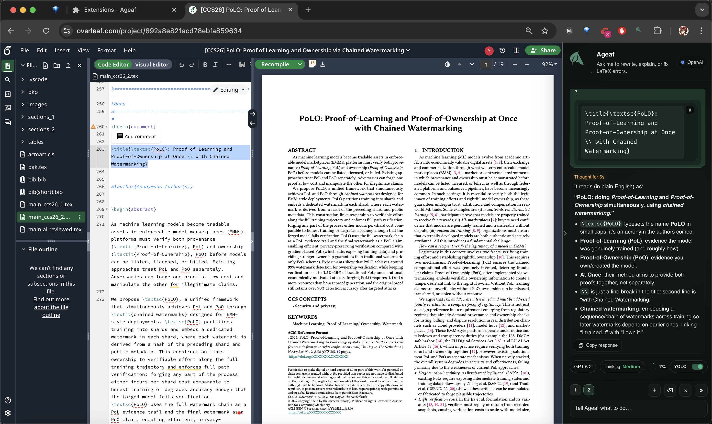

#  Ageaf



Ageaf is an Chrome Plugin that adds an agent panel specifically to Overleaf, enabling Claude Code and Codex CLI features.

## Features

- In-page agent panel
- Rewrite selection
- Fix compile errors
- Bib cleanup and related content discovery

## Authentication & Requirements

Ageaf integrates with [Claude Code](https://code.claude.com/docs/en/overview) and [Codex CLI](https://developers.openai.com/codex/cli) agents. Per the terms of service of Anthropic and OpenAI, authentication and subscription management are handled through their official entrypoints:

- **Claude Code**: [https://code.claude.com/docs/en/overview](https://code.claude.com/docs/en/overview)
- **Codex CLI**: [https://developers.openai.com/codex/cli](https://developers.openai.com/codex/cli)

You must have either:
- An official subscription (Claude Pro/Max/Teams/Enterprise or ChatGPT Plus/Pro/Business/Enterprise), or
- Valid API keys

**We strongly encourage using official subscriptions** for better cost-efficiency, higher token limits, and a seamless experience with Ageaf.

## Quick Start

### Local Development
0. Under the project directory.

1. Install dependencies and build and load the extension:
   ```bash
   npm install
   npm run watch
   ```

2. (A separate terminal) Install dependencies for the host and start the host:
   ```bash
   cd host && npm install
   npm run dev
   ```
   
   Then load the unpacked extension:
   - Open Chrome and navigate to `chrome://extensions`
   - Enable "Developer mode" (toggle in the top-right corner)
   - Click "Load unpacked"
   - Select the `build/` directory from this repository
   - After making changes, click the reload icon on the extension card in `chrome://extensions`, then refresh your Overleaf tab

## Companion App (macOS)

Ageaf supports two connection modes:

- **HTTP (development)**: run the host locally via `cd host && npm run dev` and set Transport = `HTTP`.
- **Native Messaging (distribution)**: install the companion host app and set Transport = `Native Messaging (prod)`.

### Install via Homebrew (recommended for technical users)

1. Add the Homebrew tap (once published):
   ```bash
   brew update
   brew tap onireimu/ageaf-host
   ```

2. Install the host:
   ```bash
   brew install ageaf-host
   ```

3. Register the Chrome native messaging manifest (defaults to the Web Store extension ID):
   ```bash
   ageaf-host-install-manifest
   ```
   If you’re using an unpacked extension (different ID), pass it explicitly:
   ```bash
   ageaf-host-install-manifest <EXTENSION_ID>
   ```

4. Fully quit and reopen Chrome, then in Overleaf open Ageaf Settings → Connection:
   - Transport = `Native Messaging (prod)`
   - Click **Retry** (Native host status should become `available`)

Uninstall (Homebrew):
```bash
ageaf-host-uninstall-manifest
brew uninstall ageaf-host
```

Reinstall (Homebrew):
```bash
brew uninstall ageaf-host
brew install ageaf-host
ageaf-host-install-manifest
```

Local testing (maintainers):
```bash
brew tap-new onireimu/ageaf-host
cp host/scripts/homebrew/ageaf-host.rb "$(brew --repo onireimu/ageaf-host)/Formula/ageaf-host.rb"
brew install ageaf-host
```

### Install via unsigned download (.pkg / .tar.gz)

You can also install the companion app from an unsigned `.pkg` or `.tar.gz` (to be uploaded separately).

Maintainers:
```bash
./host/scripts/macos/build-installer-pkg.sh --extension-id gafkbigpgbpcbmkdllomaoogcbebonlj
# outputs: dist-native/ageaf-host-macos-unsigned.pkg
```

Because it is **unsigned / not notarized**, macOS may show a warning the first time it runs native components.
If blocked, go to:
System Settings → **Privacy & Security** → “Open Anyway”.

Uninstall (unsigned .pkg):
```bash
sudo rm -f /usr/local/bin/ageaf-host /usr/local/bin/ageaf-host-install-manifest
sudo rm -rf /usr/local/share/ageaf-host
sudo rm -f /Library/Google/Chrome/NativeMessagingHosts/com.ageaf.host.json
rm -f "$HOME/Library/Application Support/Google/Chrome/NativeMessagingHosts/com.ageaf.host.json"
```

Troubleshooting (“Native host error: forbidden”):
- Your manifest `allowed_origins` must match your extension ID (unpacked extensions have a different ID).
- Remove stale manifests if you previously installed via `.pkg` and then Homebrew:
  - System: `/Library/Google/Chrome/NativeMessagingHosts/com.ageaf.host.json`
  - User: `~/Library/Application Support/Google/Chrome/NativeMessagingHosts/com.ageaf.host.json`

## License

MIT License. See [LICENSE](LICENSE) for details.
