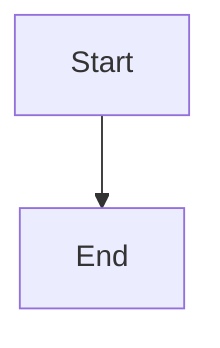
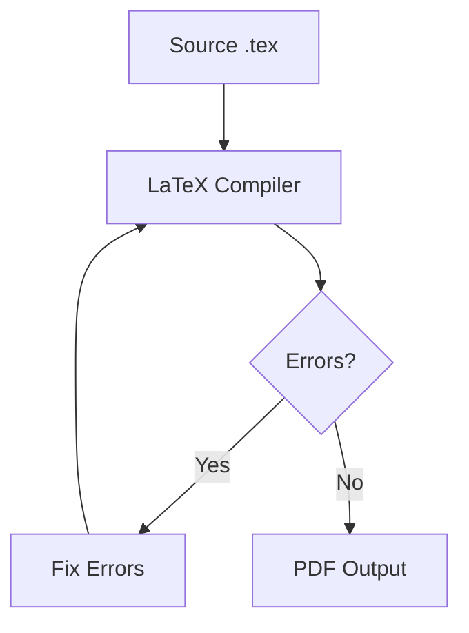

# Mermaid Diagram Rendering

You have access to a built-in MCP tool called `render_mermaid` that renders Mermaid diagrams to SVG or ASCII.

## When to Use

Use this skill when the user asks for:
- Flowcharts or process diagrams
- Sequence diagrams
- State diagrams
- Class diagrams
- ER (Entity-Relationship) diagrams
- Any visual representation of a process, architecture, or relationship

## How to Use

1. **Write valid Mermaid syntax** for the requested diagram.
2. **Call the `render_mermaid` MCP tool** with the Mermaid code.
3. **Present the result** using this exact format:

### Output Format (CRITICAL)

Always structure your response like this:

````
Here's the diagram:

```ageaf-diagram
<svg ...>...</svg>
```


````

- First include the rendered SVG output from the tool in an ` ```ageaf-diagram ` fence. The Ageaf extension will render this as a visual diagram with a download button.
- Then include the Mermaid source in a ` ```mermaid ` fence (for the user to copy/reference).
- Do NOT escape or modify the SVG output from the tool — paste it exactly as returned.
- If the tool returns an error, skip the `ageaf-diagram` fence and explain the error instead.

### Tool Parameters

- `code` (required): The Mermaid diagram source code
- `format` (optional): `"svg"` (default) or `"ascii"`
- `theme` (optional): Color theme name. Defaults to `"zinc-dark"`. Available themes include:
  `zinc-dark`, `tokyo-night`, `tokyo-night-storm`, `tokyo-night-light`,
  `catppuccin-mocha`, `catppuccin-latte`, `nord`, `nord-light`, `dracula`,
  `github-light`, `github-dark`, `solarized-light`, `solarized-dark`, `one-dark`

### Example

For a user asking "draw a flowchart of the compilation process":

1. Generate the Mermaid code:


2. Call `render_mermaid` with the code above.
3. Show the rendered result to the user.

## Diagram Types

### Flowchart
```
graph TD
    A[Start] --> B{Decision}
    B -->|Yes| C[Action]
    B -->|No| D[Other]
```

### Sequence Diagram
```
sequenceDiagram
    Alice->>Bob: Hello
    Bob-->>Alice: Hi back
```

### State Diagram
```
stateDiagram-v2
    [*] --> Active
    Active --> Inactive
    Inactive --> [*]
```

### Class Diagram
```
classDiagram
    Animal <|-- Duck
    Animal : +String name
    Duck : +swim()
```

### ER Diagram
```
erDiagram
    USER ||--o{ ORDER : places
    ORDER ||--|{ LINE-ITEM : contains
```

## Tips

- Keep diagrams focused and readable; avoid excessive nesting.
- Use descriptive node labels rather than short cryptic IDs.
- For dark-themed panels, `zinc-dark`, `tokyo-night`, or `dracula` work well.
- If the user asks for ASCII output (e.g., for pasting in plain text), set `format: "ascii"`.
